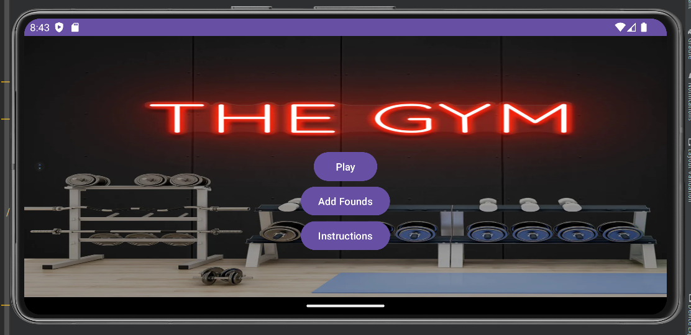
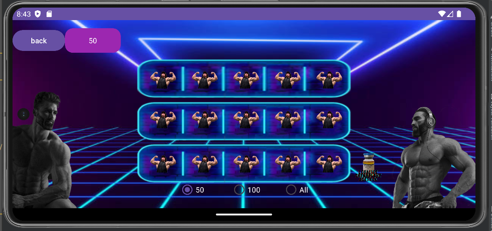
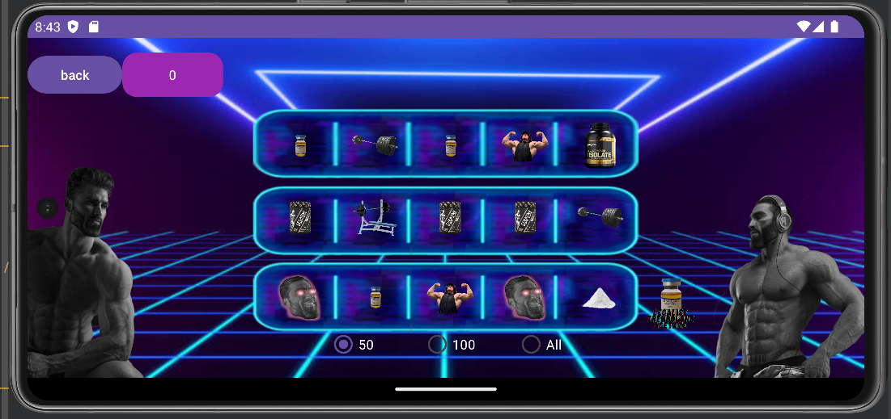
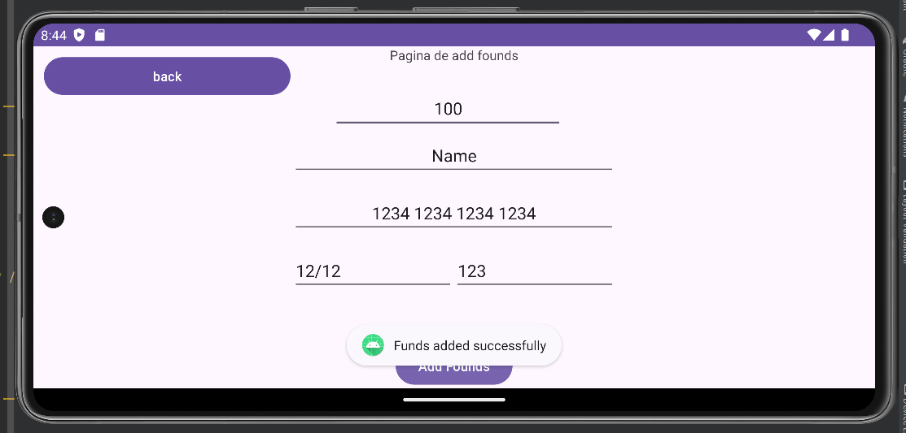
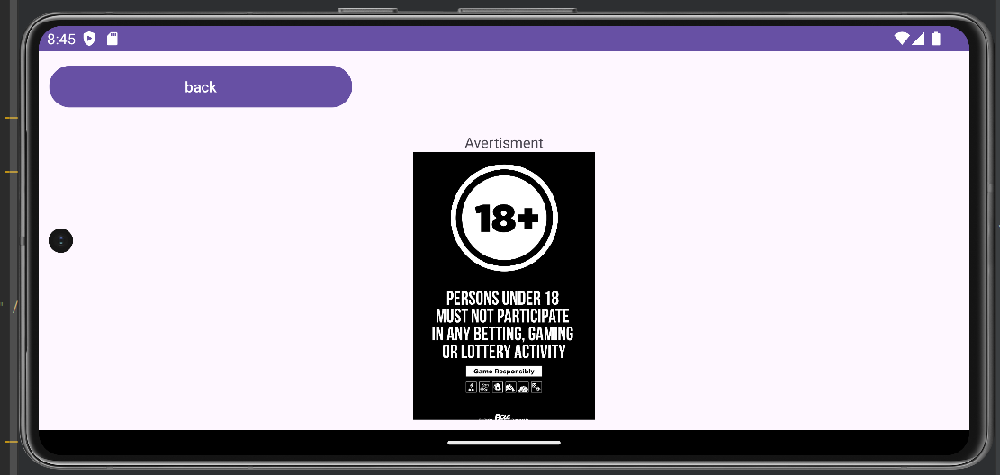

# Slots la GymBro aka Vericu

## Description
Slots at GymBro (aka Vericu) is an entertainment app that simulates the experience of playing a slot machine in a virtual environment. The aim of the game is to get winning combinations of symbols on the reels to earn points and advance in the game.

## How to run

Firs  of all, you need to clone the repository :

        git clone https://github.com/Andrei6700/Slots-at-GymBro-aka-Vericu-.git

## Bugs
The application works in optimal parameters but there are a few problems, one of them being :
- checking the images after the scrolling has stopped, all the images don't work as they should, so the chances of winning are low 

## Contributions
Slots at GymBro (aka Vericu) is an open-source project and is open for contributions from the developer community. If you have suggestions for improving the app or have identified issues that need to be fixed, I encourage you to contribute to the project via pull requests.

## Images

